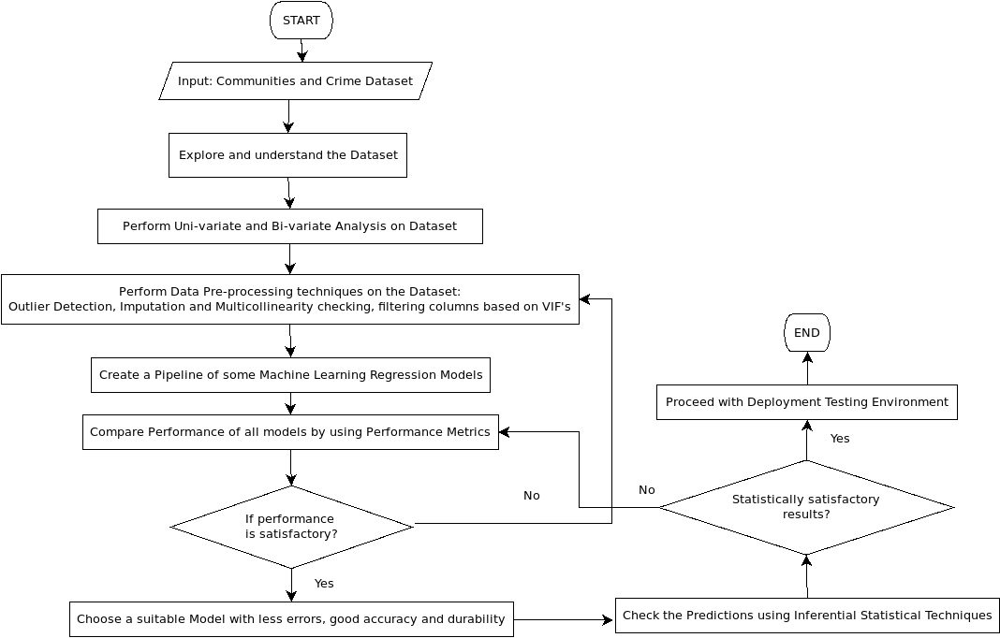

# Crime_Rate_Prediction
The project is based on an idea to predict the crime rate of an area under observation by the Crime Detection Unit based on their specific characteristics, determined by the model used.

Refer to the Dataset communities_data.txt from https://github.com/sujayrittikar/datasets

Input Features:
1. medFamInc: depicts the median of income of families.
2. PctUnemployed: gives the percentage of people who are not employed and their age is above 16. 
3. PctIlleg: shows the  percentage of kids born to unmarried couples.
4. PctImmigRecent: shows the  percentage of immigrants who immigrated within the last 3 years.
5. PctRecentImmig: percent of people who have immigrated within the last  3 years.
6. HousVacant: shows number of houses where no one is living.
7. PopDens: shows population density in persons per square mile.

Flowchart:

Format: 
